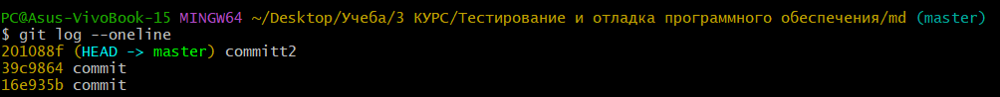

#ТУТОРИАЛ ПО GIT
##1. ИНИЦИАЛИЗАЦИЯ И ДОБАВЛЕНИЕ ФАЙЛА
git init
: Команда git init создает новый репозиторий Git. С ее помощью можно преобразовать существующий проект без управления версиями в репозиторий Git или инициализировать новый пустой репозиторий. Большинство остальных команд Git невозможно использовать без инициализации репозитория, поэтому данная команда обычно выполняется первой в рамках нового проекта.

git add
: Команда git add — это первая команда в цепочке операций, предписывающей Git «сохранить» снимок текущего состояния проекта в истории коммитов. Когда git add используется как отдельная команда, она переносит ожидающие изменения из рабочего каталога в раздел проиндексированных файлов. Команда git status проверяет текущее состояние репозитория; с ее помощью можно убедиться, что команда git add добавила нужные изменения.

После добавления файла необходимо сделать его "слепок", сохранив в акутальном состоянии с помощью команды __git commit -m "название"__

##2. ПРОСМОТР КАТАЛОГА И ИЗМЕНЕНИЙ

После создания нового коммита можно посмтореть его разницу с предыдущим с помощью команды __git diff__

git diff
: Команда git diff позволяет сравнивать два различных коммита. Сначала нужно определить хеш (ID) коммитов, которые требуется сравнивать. Можно воспользоваться командой git log, чтобы вывести список коммитов и их идентификаторы:
git log --oneline.

Для вывода разнообразной информации по коммитах можно использовать команду __git log__. У этой команды есть разные опции, самая используемая из них — _--oneline_. Она показывает хеш в укороченном формате, ветку, в которой сделан коммит, а также текст коммита. Чтобы использовать эту опцию (как и любую другую), нужно добавить её после команды: git log--oneline.

Пример использования git log --oneline

#3. СОЗДАНИЕ НОВОЙ ВЕТКИ И ЕЁ ОБЪЕДИНЕНИЕ С ОСНОВНОЙ

Для создания параллельной ветки существует команда __git branch "название"__
Для перехода между объектами, такими как файлы, коммиты и ветки необходима команда __git checkout__

В параллеьная ветка не затрагивает основную, в ней можно делать отдельные коммиты, а позже объединить эту ветку с основной. 
Для этого надо перейди в основную ветку командой __git merge master__

#4. GIT IGNORE
Файл _.gitignore_ – это обычный текстовый файл, который содержит список всех указанных файлов и папок проекта, которые Git должен игнорировать и не отслеживать.
Внутри файла .gitignore вы можете указать Git игнорировать только один файл или одну папку, указав имя или шаблон этого конкретного файла или папки. Используя такой же подход, вы можете указать Git игнорировать несколько файлов или папок.